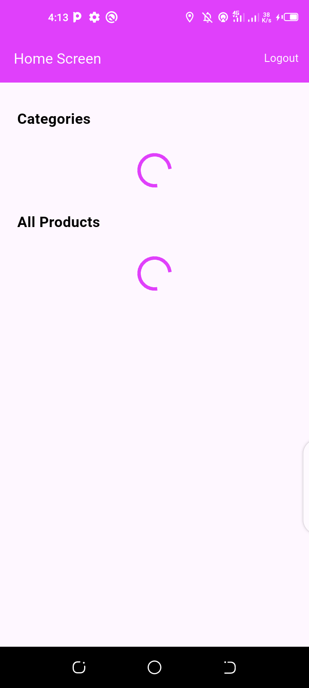
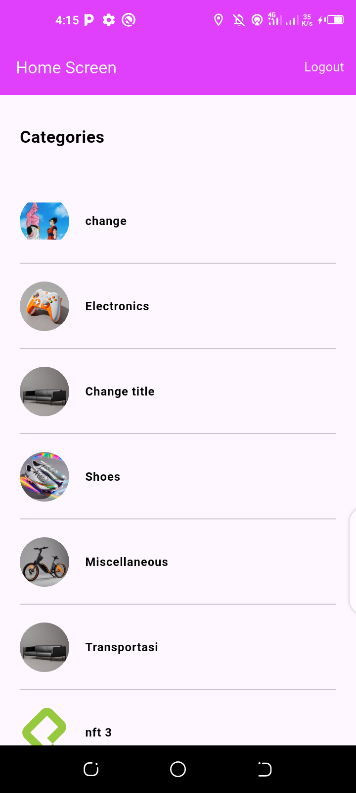
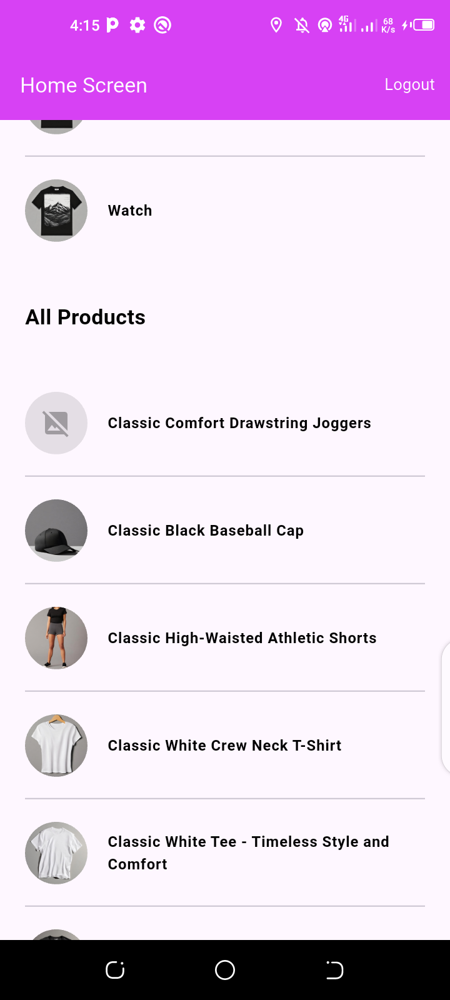
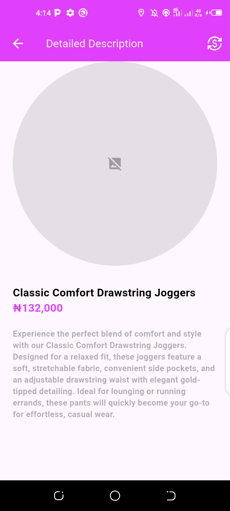
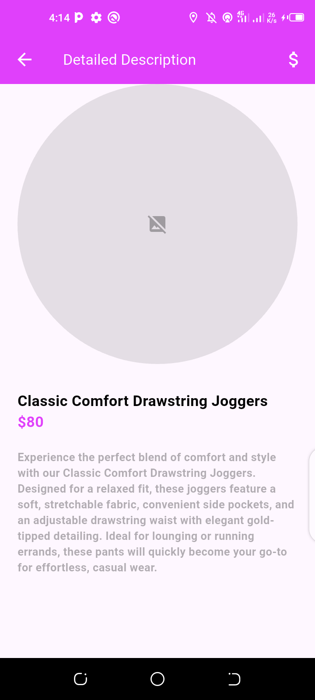

# sca_shopper

A Flutter-based shopping application utilizing the Fake Store API. This app provides a seamless shopping experience with features like user authentication, product categorization, and price conversion.

## Features✨

- User Authentication: Secure login system to personalize the shopping experience.
- Product Categories: Browse products by categories for easy navigation.
- Product Details: Detailed information about each product.
- Price Conversion: Easily toggle between Naira (₦) and Dollar ($) with a single Icon click.

## Screenshots 📸








## A video showcasing the app's functionality 🎥

- [Shopper Application Demo](https://drive.google.com/file/d/1SjlgmwvB163GMaqgwOeu7gsGixyCvD29/view?usp=drive_link)


## Installation 🚀

To set up the project locally, follow these steps:

1. Clone the repository:
   ```bash
   git clone https://github.com/FavourTy/shopper_app

2. Navigate to the project directory:
   ```bash
   cd shopper_app

3. Install the required dependencies:
   ```bash
   flutter pub get 

4. Run the app:
   ```bash
   flutter run

## Technologies Used 🛠️

- Flutter
- Dart
- Fake Store API 